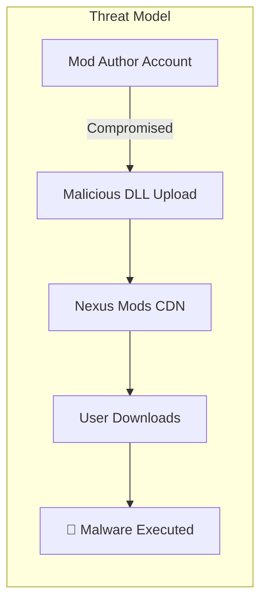
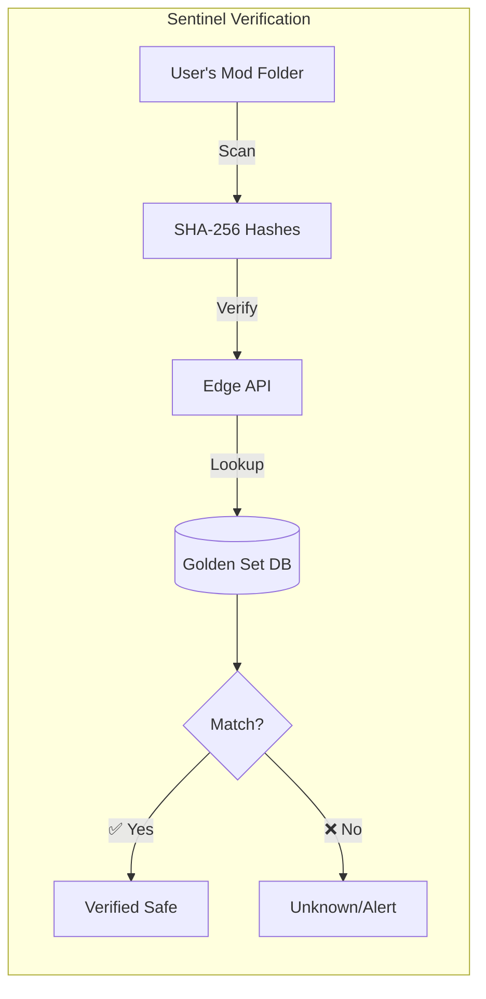
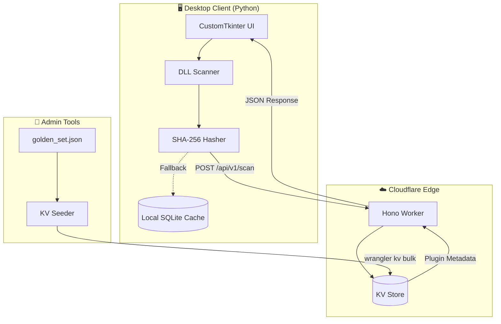
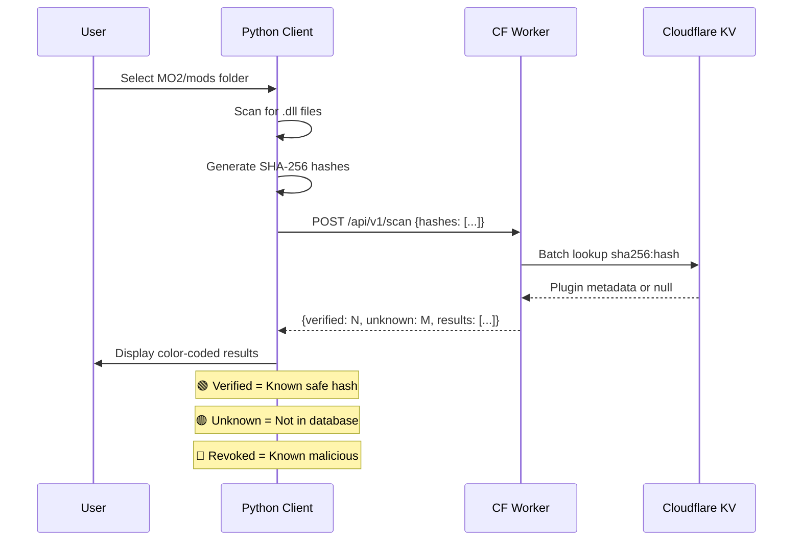
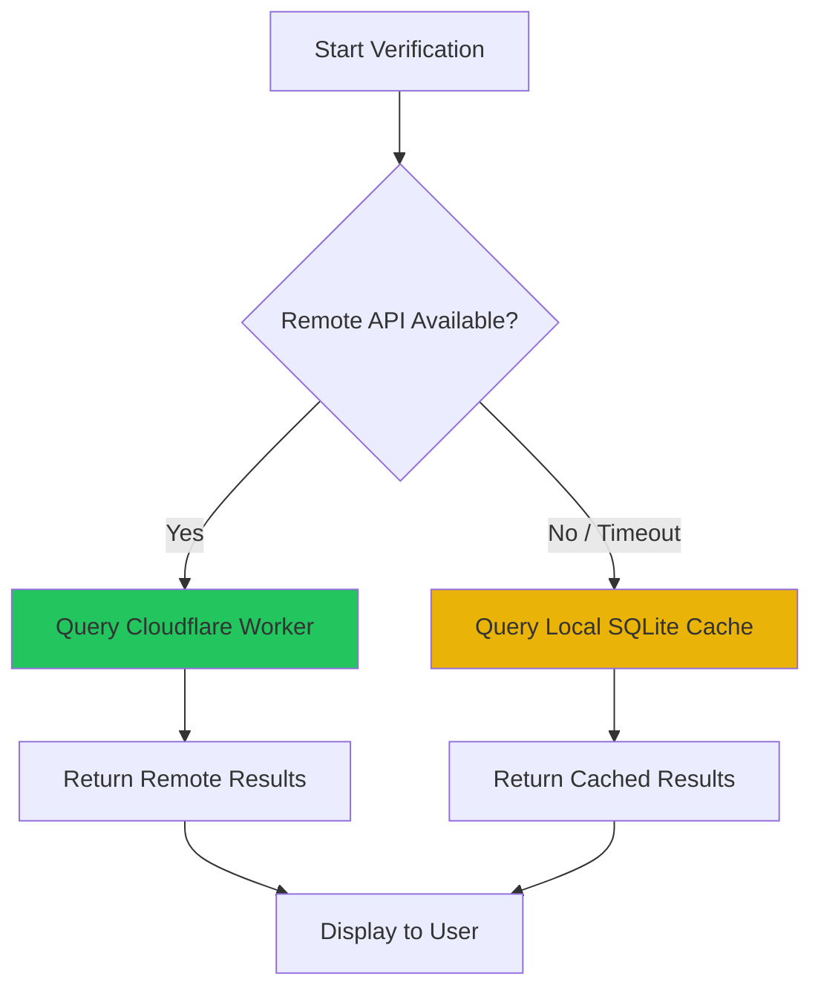
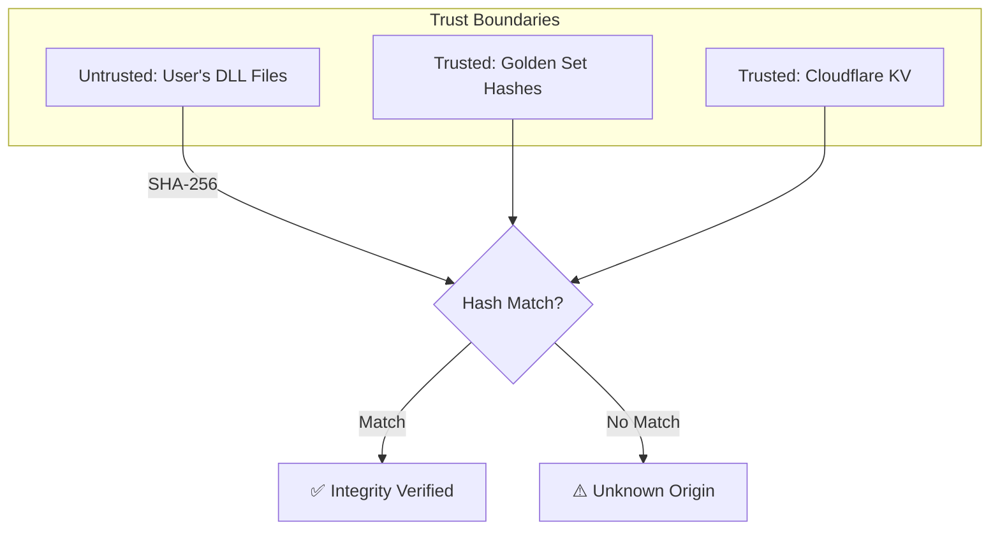

# Skyrim Sentinel

**Supply Chain Security for the Skyrim Modding Ecosystem**

[](https://workers.cloudflare.com/)
[](https://python.org)
[](https://typescriptlang.org)


---

## Overview

Sentinel is a client-side integrity verification tool for SKSE (Skyrim Script Extender) plugins. It implements a **Zero Trust** model for the modding ecosystem by verifying DLL file hashes against a curated "Golden Set" database.

### The Problem



- Users download compiled binaries (`.dll`) from Nexus without verification
- Compromised accounts can distribute malware via "updates"
- No easy way to verify if a DLL matches the official release

### The Solution



---

## Architecture



### Components

| Component | Technology | Purpose |
|-----------|------------|---------|
| **Desktop Client** | Python 3.14 + CustomTkinter | Scans mods folder, displays verification results |
| **Edge API** | Cloudflare Workers + Hono | Stateless hash verification endpoint |
| **Golden Set DB** | Cloudflare KV | Key-value store of verified plugin hashes |
| **Local Cache** | SQLite | Offline fallback when API unavailable |

---

## Data Flow



---

## Project Structure

```
skyrim-sentinel/
├── sentinel-client/          # Python desktop application
│   ├── main.py              # Entry point
│   ├── scanner.py           # DLL discovery & hashing
│   ├── api_client.py        # API client + hybrid verifier
│   ├── local_cache.py       # SQLite offline cache
│   └── ui/
│       └── app.py           # CustomTkinter GUI
│
├── sentinel-worker/          # Cloudflare Worker (TypeScript)
│   ├── src/
│   │   ├── index.ts         # Hono routes
│   │   └── types.ts         # Type definitions
│   └── wrangler.jsonc       # Worker configuration
│
└── tools/                    # Admin utilities
    ├── golden_set.json      # Curated plugin database
    ├── seed_kv.ts           # KV bulk uploader
    ├── hasher.py            # CLI hash utility
    └── sync_golden_set.py   # Sync scan results to golden set
```

---

## Quick Start

### Client

```bash
cd sentinel-client
uv sync                    # Install dependencies
uv run python main.py      # Launch GUI
```

### Worker (Development)

```bash
cd sentinel-worker
npm install
npx wrangler dev           # Local dev server on :8787
```

### Deploy to Production

```bash
cd sentinel-worker
npx wrangler deploy        # Deploy to Cloudflare

cd ../tools
npx ts-node seed_kv.ts     # Seed KV with golden_set.json
```

---

## API Reference

### `POST /api/v1/scan`

Verify a batch of SHA-256 hashes against the Golden Set.

**Request:**
```json
{
  "hashes": [
    "44f679d547244fb60bd10f9e705ba1d0ee421e4951ebc211070fe5240b54f14a",
    "1aff9914d9685c16f7dce11882186ca5dd15402c37159bc45ce1584ab3475e70"
  ]
}
```

**Response:**
```json
{
  "scanned": 2,
  "verified": 1,
  "unknown": 1,
  "revoked": 0,
  "timestamp": "2026-01-18T12:00:00.000Z",
  "results": [
    {
      "hash": "44f679d547244fb60bd10f9e705ba1d0...",
      "status": "verified",
      "plugin": {
        "name": "Engine Fixes",
        "nexusId": 17230,
        "filename": "EngineFixes.dll",
        "author": "aers"
      }
    },
    {
      "hash": "1aff9914d9685c16f7dce11882186ca5...",
      "status": "unknown",
      "plugin": null
    }
  ]
}
```

### `GET /health`

Health check endpoint.

```json
{
  "status": "ok",
  "timestamp": "2026-01-18T12:00:00.000Z",
  "version": "1.0.0"
}
```

---

## Hybrid Verification Mode



The client uses a **remote-first, local-fallback** strategy:

1. **Remote (Primary):** Queries the Cloudflare Worker for up-to-date security data
2. **Local (Fallback):** Uses SQLite cache populated from `golden_set.json` when offline

---

## Golden Set Database

The Golden Set contains verified hashes for trusted SKSE plugins:

| Plugin | Nexus ID | Files |
|--------|----------|-------|
| SSE Engine Fixes | 17230 | EngineFixes.dll |
| powerofthree's Tweaks | 51073 | po3_Tweaks.dll |
| Scrambled Bugs | 43532 | ScrambledBugs.dll |
| RaceMenu | 19080 | skee64.dll |
| ... | ... | ... |

**Current Coverage:** 100+ verified plugin DLLs

---

## Security Model



**Key Principles:**

- **Zero Trust:** Every DLL is unverified until proven otherwise
- **Cryptographic Verification:** SHA-256 provides collision resistance
- **Edge-First:** Cloudflare's global network ensures low latency
- **Offline Capable:** Local cache enables air-gapped operation

---

## License

[](LICENSE)


